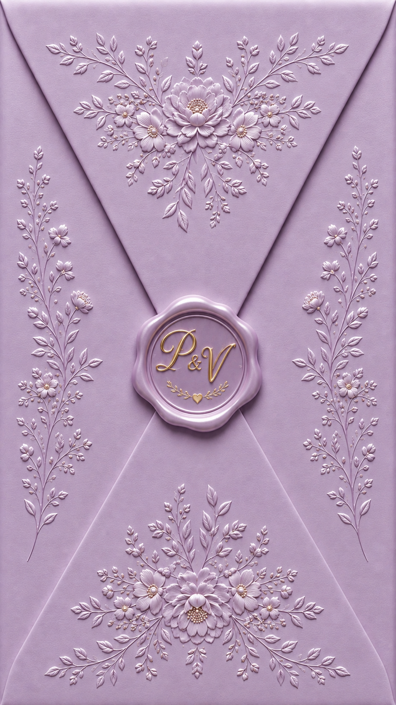

# ✨ Luxury Digital Wedding Invitation | Vikki & Pappu ✨

A luxury, interactive, cinematic digital wedding invitation website built exclusively with **HTML5, CSS3, and Vanilla JavaScript** — without any external frameworks or libraries.



---

## 🌟 Key Features

### 💌 1. Cinematic Envelope Opening
- **Full-Screen Tactile Stationery**: Designed to look and feel like a handcrafted physical wedding envelope with gold embossed monogram wax seal (`P & V`).
- **Seamless Video & Flare Animation**: Tap-to-open sequence with golden light bloom, particle dust, and smooth camera zoom transition into the invitation.
- **Mobile First Edge-to-Edge**: Optimized with dynamic viewport units (`100dvh`) for flawless mobile presentation without black letterboxes.

### 📅 2. Interactive Date Reveal (Gold Leaf Scratch Card)
- Touch or drag interactive canvas covered in champagne gold foil.
- Scratching or tapping immediately unveils the wedding date: **Wednesday, June 23, 2027**.

### 🦋 3. 3D Butterfly Photo Slider & Lightbox
- **Interactive 3D Carousel**: Elegant 3D arched card deck with smooth swipe gestures on mobile and keyboard controls.
- **Fluttering Golden Butterflies**: Animated SVG golden butterflies with 3D flapping wings and sparkling dust trails that fly across the stage on every slide transition.
- **Fullscreen Lightbox**: Tap any photo for high-resolution inspection with next/previous navigation.

### 🎵 4. Built-in Romantic Wedding Music Engine
- **Web Audio API Melody Synthesizer**: Generates a gentle, acoustic harp & piano chord progression (Cmaj9, Am7, Fmaj7, Gsus4) with soft reverb and chime bells.
- **Floating Controls**: Slide-in audio toggle with smooth play/pause and volume fading.

### ⛪ 5. Holy Matrimony & Order of Service
- Traditional Christian ceremony timeline (Guest Welcome, Nuptial Blessing, Cake Cutting, Banquet Feast, and First Dance) with scroll-triggered animations.
- Scripture reflections from *1 Corinthians 13*.

### 💬 6. WhatsApp Wishes & Blessings
- Replaces standard RSVP with a direct WhatsApp message generator.
- Guests input their name and heartfelt wishes, and tapping **"SEND WISHES VIA WHATSAPP"** opens WhatsApp to **`+91 9499912508`** with pre-formatted blessings.

### 📍 7. Venue & Calendar Integration
- Venue details for **M Weddings & Conventions, Chennai**.
- Direct Google Maps navigation link.
- **Add to Calendar**: Generates and downloads standard `.ics` calendar events for Apple, Google, and Outlook calendars.

---

## 🛠️ Technology Stack

- **Markup**: Semantic HTML5 with OpenGraph metadata and ARIA accessibility.
- **Styling**: Vanilla CSS3 (CSS Variables, Flexbox, Grid, 3D Transforms, Keyframe Animations, Dynamic Viewports).
- **Interactivity**: Vanilla JavaScript (ES6+, Web Audio API, Canvas 2D API, IntersectionObserver API).
- **No external frameworks**: No React, Next.js, Vue, Tailwind, or Bootstrap.

---

## ⚙️ Customization (`script.js`)

All event information, couple names, date, venue, and WhatsApp number can be customized in the `weddingConfig` object at the top of `script.js`:

```javascript
const weddingConfig = {
  groomName: "Vikki",
  brideName: "Pappu",
  weddingDate: "2027-06-23T16:30:00",
  weddingDateDisplay: {
    day: "23",
    month: "JUNE",
    year: "2027"
  },
  dayName: "WEDNESDAY",
  ceremonyTime: "4:30 PM NUPTIAL SERVICE",
  venueName: "M Weddings & Conventions",
  venueAddress: "Vanagaram Main Rd, Rajankuppam, Vanagaram, Chennai, Tamil Nadu 600095",
  mapUrl: "https://maps.google.com/?q=M+Weddings+and+Conventions+Chennai",
  whatsappPhone: "919499912508",
  dressCode: "Elegant Christian Wedding Formal / Suits, Gowns & Pastel Traditional Attire.",
  message: "Love is patient, love is kind. It always protects, always trusts, always hopes, always perseveres. Love never fails.",
  groomFamily: "Son of Mr. & Mrs. Edward Victor",
  brideFamily: "Daughter of Mr. & Mrs. Joseph Samuel",
  locationShort: "M WEDDINGS & CONVENTIONS, CHENNAI"
};
```

---

## 📂 Project Structure

```text
├── index.html          # Main HTML5 document
├── style.css           # Complete luxury stylesheet with responsive breakpoints
├── script.js           # Interactive logic, 3D slider, canvas scratch, & audio synthesizer
├── README.md           # Documentation
└── assets/             # Media and stationery assets
    ├── envelope.png    # Lavender luxury stationery envelope graphic
    ├── opening.mp4     # Cinematic envelope opening animation video
    ├── VP1.png         # Couple portrait 1
    ├── VP2.png         # Couple portrait 2
    ├── VP3.png         # Couple portrait 3
    ├── VP4.png         # Couple portrait 4
    ├── VP9.png         # Couple portrait 5
    └── VP10.png        # Couple portrait 6
```

---

## 🚀 Deployment

### 1. Vercel (Recommended)
1. Push this repository to GitHub.
2. Import repository in [Vercel](https://vercel.com).
3. Framework preset: **Other / Static**.
4. Click **Deploy**.

### 2. GitHub Pages
1. Go to repository **Settings** -> **Pages**.
2. Under **Build and deployment**, select source branch: `main` / `root`.
3. Save to publish instantly.

---

## 💍 License
Crafted with love for the wedding celebration of **Vikki & Pappu** • June 23, 2027.
